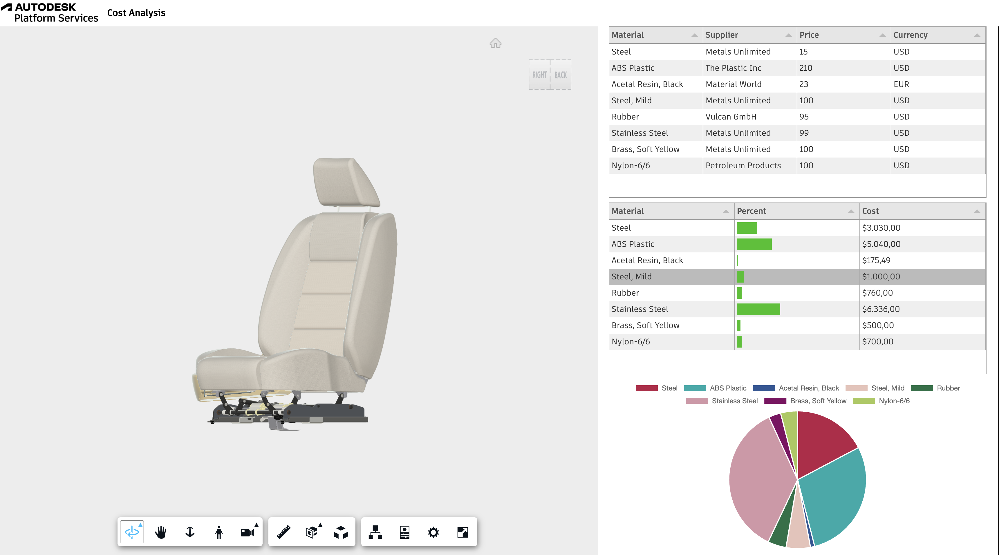

# aps-rcdb


[](https://nodejs.org)
[](https://www.npmjs.com/)
[](https://opensource.org/licenses/MIT)

This is an APS Responsive Connected Database: A responsive javascript based web application that showcases the use of APS Viewer and APS web services, working in a connected environment with integrated data from multiple databases.



## Development

### Prerequisites

- [APS credentials](https://forge.autodesk.com/en/docs/oauth/v2/tutorials/create-app)
- [Node.js](https://nodejs.org) (we recommend the Long Term Support version)
- Terminal (for example, [Windows Command Prompt](https://en.wikipedia.org/wiki/Cmd.exe)
  or [macOS Terminal](https://support.apple.com/guide/terminal/welcome/mac))

### MongoDB database

Install [MongoDB](https://www.mongodb.com/), start an instance locally and create a database - we recommend to follow the tutorial [here](https://docs.mongodb.com/manual/tutorial/getting-started/) for detailed instructions.

Import the four data collections using the JSON files [here](./resources/db) to your database, we recommend to use [MongoDB Compass](https://www.mongodb.com/products/compass) or [Studio3T](https://studio3t.com/download/) as client tools for this task.

```
   YourDatabase

   |-------------rcdb.materials

```

If you would like run the sample w/o setting up MongoDB, see how to run the Extension Gallery as the backend in `tips and tricks` section later.

### Setup & Run

- Clone this repository
- Install dependencies: `npm install`
- Setup environment variables:
  - `APS_CLIENT_ID` - your APS application client ID
  - `APS_CLIENT_SECRET` - your APS application client secret
  - `MONGODB_URL` - your MONGODB_URL
  - `APS_BUCKET` (optional) - name of APS bucket to store your designs in
- Run the server: `npm start`

> When using [Visual Studio Code](https://code.visualstudio.com),
> you can specify the env. variables listed above in a _.env_ file in this
> folder, and run & debug the application directly from the editor.

## Troubleshooting

Please contact us via https://forge.autodesk.com/en/support/get-help.

## License

This sample is licensed under the terms of the [MIT License](http://opensource.org/licenses/MIT).
Please see the [LICENSE](LICENSE) file for more details.
